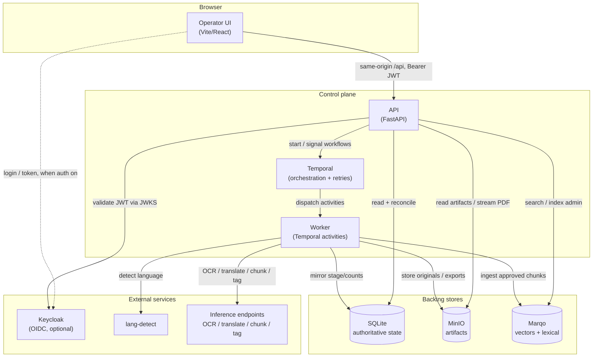
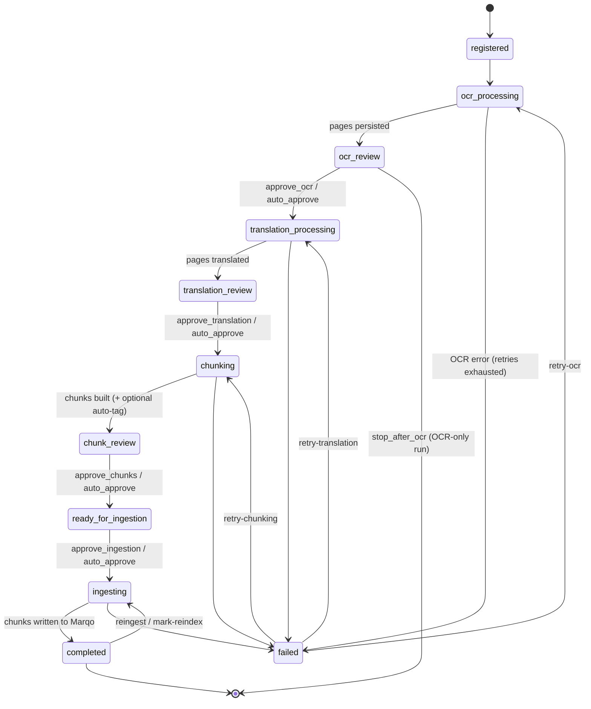
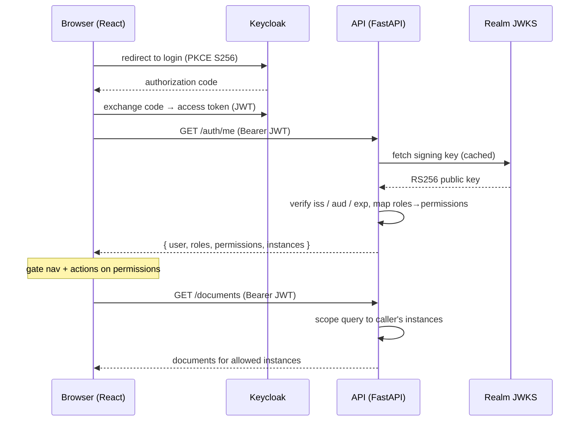

# Design Document — Document Ingestion Pipeline

This document explains **how the system is built and why**. It complements the
[`README.md`](../README.md), which covers **what the system does and how to run
it**. Where the README is a user/operator guide, this is an architecture and
design-rationale reference for contributors and reviewers. Everything here is
grounded in the actual code under `pipeline/`, `ui/`, `lang-detect/`, and
`scripts/`.

## Table of contents

1. [Overview & goals](#1-overview--goals)
2. [System architecture](#2-system-architecture)
3. [Ingestion pipeline](#3-ingestion-pipeline)
4. [Data model & storage responsibilities](#4-data-model--storage-responsibilities)
5. [Search model](#5-search-model)
6. [Authentication & authorization](#6-authentication--authorization)
7. [Frontend architecture](#7-frontend-architecture)
8. [API surface](#8-api-surface)
9. [Deployment model](#9-deployment-model)
10. [Design decisions & trade-offs](#10-design-decisions--trade-offs)
11. [Extension points / roadmap](#11-extension-points--roadmap)

---

## 1. Overview & goals

The system turns heterogeneous source files — PDFs, office documents, images,
and spreadsheets — into a searchable vector index of reviewed, provenance-linked
text chunks. The processing path is:

> **source file → normalize → OCR / native extract → (detect + translate) →
> chunk → (tag) → embed → searchable index**

The distinguishing property is that this path is **review-driven**. Rather than
running end-to-end automatically, the pipeline pauses at explicit human-review
gates (after OCR, after translation, after chunking, and before ingestion), so
operators can inspect and correct outputs before they reach the index.

### Design goals

- **Traceability over magic.** Every stage produces persisted, inspectable
  state and durable artifacts. Chunks retain lineage back to their source pages,
  run configuration, and provider/model metadata.
- **Operational control.** The UI is an operations console for *managing* the
  pipeline (stages, runtime, jobs, artifacts, index state, audit), not just an
  upload form.
- **Resilience of long-running work.** OCR, translation, and chunking are slow
  and failure-prone (large files, remote model endpoints). Orchestration,
  retries, and review-gate suspension are delegated to a durable workflow
  engine.
- **Configuration-driven providers.** OCR, translation, chunking, and domain
  tagging each resolve their provider/model/endpoint from environment
  configuration, so the same code targets different backends without edits.
- **Forward-ready multi-tenancy.** A tenant (`instance`) dimension threads
  through storage, ingest, and search so tenant isolation can be switched on
  without a disruptive data migration.

### Non-goals

- It is **not** a real-time / low-latency inference service. Work is
  batch-shaped and gated on human review.
- It is **not** the system of record for *content editing* semantics beyond the
  pipeline — the search index is a downstream projection, not the source of
  truth.
- It does **not** bundle the model servers. OCR/translation/chunking/tagging
  call out to external inference endpoints configured per deployment.
- Authentication is **not** on by default; it is an opt-in layer (see §6, §9).

---

## 2. System architecture

The stack is a set of containerized services (see `docker-compose.yml`) split
into a **control plane** (API, worker, orchestration, state) and a set of
**backing stores** (object storage, vector index, workflow database).

| Service | Role | Default port |
|---|---|---|
| `ui` | Vite/React operator console; same-origin `/api` proxy to the API | 3000 |
| `api` | FastAPI control plane: ingestion, review, artifacts, search, admin | 8001 |
| `worker` | Temporal worker running pipeline activities (OCR, translate, chunk, tag, ingest, state-mirror) | — |
| `temporal` | Workflow orchestration + retry engine (backed by its own Postgres) | 7233 |
| `temporal-ui` | Temporal web console | 8080 |
| `marqo` | Vector + lexical search index over approved chunks | 8882 |
| `minio` | Object storage for originals, normalized files, stage artifacts | 9000 / 9001 |
| `lang-detect` | Stateless language-detection microservice (Node/TS) used before translation | internal |
| `keycloak` + `keycloak-db` | OIDC identity provider (only used when auth is enabled) | 8082 |

The API and worker are built from the **same image** but run different commands
(`uvicorn pipeline.api:app` vs `python -m pipeline.worker`). They share the same
SQLite database volume and the same provider/endpoint configuration, which keeps
the API's read/reconcile logic and the worker's write logic in lockstep.

### Component & data-flow diagram

**Interaction notes**

- The **UI never talks to Marqo or Temporal directly.** Its config pins
  `API_BASE = '/api'` (`ui/src/config.js`); Vite proxies `/api` to the API
  service (`ui/vite.config.js`). This keeps browser calls same-origin and keeps
  environment-specific hosts out of the frontend bundle.
- The **API is the read/command surface**; the **worker is the write surface**
  for pipeline content. The API starts and signals workflows but does not run
  the heavy activities itself.
- **SQLite is shared** between API and worker via a Docker volume, which is why
  the API can serve document state even while a long activity is mid-flight
  (the worker mirrors stage/counts as it goes; see §3, §4).

---

## 3. Ingestion pipeline

Orchestration lives in `pipeline/workflows.py` (Temporal workflow definitions)
and the stage work lives in `pipeline/activities.py` (Temporal activities). The
worker (`pipeline/worker.py`) registers both with the task queue.

### The main workflow: `DocumentPipelineWorkflow`

`DocumentPipelineWorkflow.run(...)` drives a document from registration to a
completed, indexed state. Between processing activities it **suspends on review
gates** using `workflow.wait_condition(...)`, resuming only when the matching
approval **signal** arrives. Each stage transition is mirrored into SQLite via a
small state-update activity so the dashboard always reflects progress even if a
Temporal query races a long-running activity.

Stage activities and their retry policies:

| Stage activity | Purpose | Retry policy (from `workflows.py`) |
|---|---|---|
| `run_ocr_and_store` | normalize + OCR/extract, persist pages | `OCR_RETRY` (20 attempts, 15s→15m backoff) |
| `detect_and_translate_pages_from_db` | per-page language detect + translate | `TRANSLATION_RETRY` (20 attempts) |
| `create_chunks_from_db` | build chunks from reviewed page text | `CHUNK_RETRY` (10 attempts) |
| `auto_tag_chunks_from_db` | domain-tag chunks (gated by `auto-tag-v1` patch) | `CHUNK_RETRY` |
| `ingest_document_from_db` | write approved chunks to Marqo | `INGEST_RETRY` (15 attempts) |
| `update_document_state` | mirror stage/counts to SQLite | `STATE_UPDATE_RETRY` (run as a *local* activity behind the `local-state-update-v1` patch, so tiny state writes are not starved behind long activities) |

### Review gates and `auto_approve`

By default the workflow stops at four gates and waits for a signal:

- `approve_ocr` → leaves `ocr_review`
- `approve_translation` → leaves `translation_review`
- `approve_chunks` → leaves `chunk_review`
- `approve_ingestion` → leaves `ready_for_ingestion`

When the workflow is started with `auto_approve=True`, every
`wait_condition` gate is skipped and the document flows straight through
(registration → completed) with no human interaction — useful for trusted
bulk/backfill ingestion. A separate `stop_after_ocr=True` flag ends the run at
`ocr_review` for OCR-only passes.

### Retry & re-ingest / partial-stage workflows

Beyond the main workflow, `workflows.py` defines focused workflows that resume
an existing document at a single stage rather than re-running everything:

- **`OcrOnlyWorkflow`** — re-run/retry OCR, stop at OCR review.
- **`TranslationOnlyWorkflow`** — resume from OCR review, translate, stop at
  translation review.
- **`ChunkingOnlyWorkflow`** — resume from translation review, chunk, stop at
  chunk review.
- **`ReingestionWorkflow`** — re-push already-approved chunks to Marqo
  (the `POST /reingest` path), without redoing OCR/translation/chunking.

These back the `retry-ocr` / `retry-translation` / `retry-chunking` /
`reingest` endpoints and are how a document that failed or was edited late in
the flow is nudged forward without losing prior work. Because Temporal is
durable and activities are idempotent-by-workflow-id, retries are safe.

### Stage state machine

`failed` is reached whenever a stage exhausts its retry policy; the error is
mirrored into SQLite so it surfaces in the operations queue. From `failed` (or a
stalled state) the partial-stage workflows above can re-drive the specific stage
that needs another attempt.

### Reconciliation

Because the workflow mirrors state into SQLite as it runs, a crash mid-stage can
leave the row behind the materialized content. `db.reconcile_materialized_state`
(exposed via `POST /documents/{id}/reconcile` and the bulk
`POST /documents/reconcile`) conservatively advances a document's row to match
what is actually persisted — e.g. if chunk rows exist, the document is moved to
`chunk_review` even if the workflow stalled. It only ever moves *forward* toward
a review state that the data already supports.

---

## 4. Data model & storage responsibilities

Four stores each own a distinct concern. Keeping them separate is deliberate:
content ownership, artifact storage, durable execution, and search retrieval
have different consistency and lifecycle needs.

| Store | Owns | Source of truth for |
|---|---|---|
| **SQLite** (`pipeline/db.py`) | documents, pages, chunks, chunk tags, jobs, artifact metadata, index status, audit logs, search settings, manifest entries | **Canonical review/content state** |
| **MinIO** | original uploads, normalized PDF/spreadsheet outputs, OCR/translation/chunk/Marqo-payload exports | **Binary artifacts** |
| **Temporal** (+ its Postgres) | workflow lifecycle, retries, review-gate suspension | **Durable execution history** (not edited content) |
| **Marqo** | embedded + lexical chunk vectors | **Search retrieval** (a downstream projection) |

### Why SQLite is authoritative

SQLite is the fallback that makes the system observable even when Temporal
queries are slow or a workflow is mid-activity. It is opened in WAL mode with an
`IMMEDIATE` isolation level and a process-wide write lock (`_db_lock`) for
thread-safe writes, and it self-migrates on startup via best-effort
`ALTER TABLE ... ADD COLUMN` helpers (`_add_column_if_missing`).

### Core records

- **`documents`** (PK `workflow_id`) — the top-level business object: identity,
  `stage`, page/chunk counts, timestamps per stage, `source_type` /
  `canonical_input_type`, `stop_after_ocr`, `reindex_required` / reason,
  `is_demo` / `is_disabled` soft-state flags, artifact back-references, and the
  **`instance`** tenant column (see below).
- **`pages`** — per-page OCR output (`original_markdown` / `edited_markdown`),
  review flags, and translation fields (`detected_language`,
  `translated_markdown` / `edited_translation`, plus translation
  provider/model/target-language provenance). The `PageData` model exposes
  `final_text` — edited translation > machine translation > edited/original
  markdown — which is what feeds chunking.
- **`chunks`** — chunked text (`original_text` / `edited_text`), `token_count`,
  page-span lineage (`page_start`/`page_end`, `source_page_numbers_json`,
  `source_spans_json`), `section_title` / `content_type`, an `is_reference`
  flag, `is_excluded` / `is_reviewed` review state, and chunking-run provenance
  (`chunking_provider` / `chunking_model` / `chunking_config_json` /
  `chunking_run_id` / `chunk_version`).
- **`chunk_tags`** — normalized `dimension:value` domain tags per chunk, with an
  `auto` / manual `source`.
- **`document_jobs`** — discrete runs (ingest, OCR-only, translation-only,
  chunking, reingestion) with status/stage and the linked Temporal
  workflow/run ids. Backs the Runs and Queue views.
- **`document_artifacts`** — metadata rows pointing at MinIO objects (originals,
  normalized files, OCR/translation/chunk exports, Marqo payload snapshots).
- **`document_index_status`** — per-(document, index) view of what has been
  pushed to Marqo: `marqo_doc_id`, `chunk_count_indexed`, timestamps,
  `schema_version`, `status`.
- **`audit_logs`** — append-only record of stage changes, page/chunk edits,
  approvals, and resets.

### The `instance` tenant column

`documents.instance` is the tenant discriminator. Its handling is intentionally
conservative:

- It is **applied on INSERT only** — `upsert_document` never overwrites an
  existing `instance` on update, so a re-upload or restart cannot silently
  reassign a document's tenant.
- Legacy / NULL rows are stamped with `DEFAULT_INSTANCE` at `init_db` time, and
  list/summary queries coalesce NULL/empty to `DEFAULT_INSTANCE` so migrated
  data still matches filters.
- List and summary queries accept an `instances` filter that the API derives
  from the caller's token claims (§6). An indexed `idx_documents_instance`
  supports it.

---

## 5. Search model

Search is a configurable Marqo retrieval surface exposed via `POST /marqo/search`
and driven by persisted defaults in the `settings` table (editable in the
Settings view; see the `SearchSettings` model).

### Embedding model & E5 prefixes

The passage schema (built in `pipeline/activities.py`) uses the
`hf/multilingual-e5-large` embedding model, whose convention requires
asymmetric prefixes:

- **Ingest side:** each chunk is embedded from a `text_for_embedding` field set
  to `"passage: <text>"`. This is the tensor field.
- **Query side:** when `useE5Prefix` is on (default), the query is wrapped as
  `"query: <text>"` (`_prepare_query_for_e5`), idempotently (it won't double
  a query that already starts with `query:`).

Getting these prefixes right is what makes multilingual tensor retrieval behave;
they are a first-class part of the schema, not an afterthought.

### Lexical vs tensor vs hybrid

The `searchMethod` setting selects the mode:

- **`TENSOR`** — semantic only, searchable attribute `text_for_embedding`.
- **`LEXICAL`** — keyword only, over `text` and `description`.
- **`HYBRID`** (default) — combines both with an `alpha` blend
  (0 = lexical, 1 = semantic), RRF or linear ranking, and a tunable `rrfK`.
  Lexical attributes are `text` + `description`; the tensor attribute is
  `text_for_embedding`.

Around the raw Marqo call the API layers: optional **query expansion**
(`queryExpansionProfile`), a **candidate pool** (`candidate_cap` /
`candidate_multiplier`, hard-capped) that is retrieved then trimmed to `top_k`,
optional **reranking** (`rerankMode`), and **per-document diversity**
(`maxChunksPerDoc`) so one document cannot dominate the result set.

### Reference filtering

When `excludeReference` is on (default), the request adds
`filter_string = "is_reference:false"`, so chunks flagged as bibliographic
references during chunking are kept out of results.

### Tenant-scoped filtering — forward-ready and tolerant

Tenant scoping is applied at query time by `_marqo_instance_filter`, which
embodies the same forward-ready posture as the storage layer:

- If the caller is **unrestricted** (admin or auth-disabled bypass) → **no
  filter**.
- If the caller is **restricted** but the live index **has no `instance` field
  yet** (a legacy single-tenant index, possibly shared with other consumers) →
  **no filter** (logged once). The system does not fail closed on an index that
  predates the tenant field.
- Only when the caller is restricted **and** the index advertises a filterable
  `instance` field is an `instance:(...)` clause AND-ed in. A restricted caller
  with an empty instance set matches nothing (`instance:(__none__)`).

The reference filter, domain-tag filter, and instance filter are merged into a
single Marqo `filter_string`. Domain-tag filtering additionally validates that
the target index actually has a `domain_tags` field, returning a clear 400
rather than a confusing empty result if it does not.

---

## 6. Authentication & authorization

Auth is implemented under `pipeline/auth/` and is **off by default**. With
`AUTH_DISABLED=true` (the shipping default), the API accepts a synthetic
`local-dev` **master_admin** with unrestricted access, so local development and
existing deploys keep working with no login. Enabling auth is config-only — no
code changes.

### Token validation

When enabled, `pipeline/auth/jwt.py` validates a Keycloak-issued Bearer JWT:

- **RS256** signatures, verified against the realm **JWKS** (cached
  `PyJWKClient`, 1h key lifespan).
- **`iss`** must equal the configured `KEYCLOAK_ISSUER` exactly — the issuer is
  whatever URL browsers use to reach Keycloak, and a mismatch rejects every
  token.
- **`aud`** must match `KEYCLOAK_AUDIENCE` (default `docs-pipeline-api`);
  audience verification is only relaxed if no audience is configured.
- **`exp`** is required (`options={"require": ["exp"]}`) with a small configurable
  leeway for clock skew.
- Startup **fails fast** (`validate_auth_config`) if auth is enabled without an
  issuer / JWKS URL, so a misconfigured deploy never silently accepts nothing.

The JWKS fetch is synchronous and can block, so `get_current_user` runs
`decode_and_validate_token` in a thread (`asyncio.to_thread`) to keep the event
loop free.

### Roles → permissions

Realm and resource-client roles are extracted from the token and mapped to a
small set of named permissions (`pipeline/auth/permissions.py`):

| Role | `upload` | `review` | `pipeline` | `search` | `admin` | `manage_users` |
|---|:---:|:---:|:---:|:---:|:---:|:---:|
| `master_admin` | ✓ | ✓ | ✓ | ✓ | ✓ | ✓ |
| `admin` | ✓ | ✓ | ✓ | ✓ | ✓ | ✓ |
| `content_curator` | ✓ | ✓ | ✓ | ✓ | | |
| `viewer` | | | | ✓ | | |

Permissions (not roles) are what the API endpoints check, via
`require_permission(...)` dependency factories exposed as `RequireUpload`,
`RequireReview`, `RequirePipeline`, `RequireSearch`, `RequireAdmin`, and
`RequireManageUsers` in `pipeline/auth/deps.py`. Unknown roles are ignored;
permissions from multiple roles union.

### Multi-tenant scoping

Tokens carry multivalued `instances` and `envs` claims (the extractor also
accepts `tenants`/`tenant` and `environments`/`env` aliases, comma/semicolon
tolerant). `pipeline/auth/tenancy.py` turns these into access decisions:

- **Non-admin** callers are scoped to their claimed `instances`. List/summary
  queries pass that scope down to SQLite; create-time operations assert the
  target instance is allowed.
- **Admins are instance-unrestricted** even when their token carries a narrow
  `instances` claim (`is_instance_unrestricted`) — an admin is a platform
  operator, not a tenant user.
- Cross-tenant document access returns **404, not 403**
  (`assert_document_instance_access`): a caller who lacks access to a document's
  instance is told it does not exist, so document ids don't leak across tenants.

### The `?access_token=` fallback

Some browser element loads — the PDF `<embed>`/`<Document>` and export `<a
href>` — cannot attach an `Authorization` header. For those, `get_current_user`
accepts the JWT as an `?access_token=` query parameter as a fallback, and the UI
appends it via `appendAccessToken(...)`. Header-based Bearer remains the primary
path for all XHR/fetch calls.

### Login + call sequence

---

## 7. Frontend architecture

The UI (`ui/`) is a Vite + React single-page operator console. Routing is
declared in `ui/src/App.jsx` (Dashboard, Documents, Queue, Runs, Indexes, New
Document, Document Ops, Search Workbench, Chunk Explorer, Settings, Audit),
wrapped in an `AppShell` with a permission-aware sidebar.

### Same-origin API + Bearer injection

- `ui/src/config.js` pins `API_BASE = '/api'`; the dev server proxies `/api`
  (and `/marqo`) to the backend (`ui/vite.config.js`). No environment-specific
  hostnames are baked into the bundle.
- `ui/src/auth/keycloak.js` is a deliberately React-free module that owns the
  Keycloak singleton and token accessors. `apiFetch(...)` is the drop-in
  `fetch` wrapper used by every call site: it proactively refreshes the token,
  injects `Authorization: Bearer`, and routes 401s back to re-login.
- When `VITE_AUTH_ENABLED` is not `true` (the default), the whole auth layer is
  inert: `apiFetch` sends no header and every gate passes, preserving the open
  local/dev experience.

### AuthProvider lifecycle

`ui/src/auth/AuthProvider.jsx` initializes Keycloak with
`onLoad: 'login-required'` + PKCE, then calls `GET /auth/me` to load the
caller's roles/permissions/instances into context. It renders explicit states:
signing-in, sign-in-failed (with retry), and **signed-in-but-no-permissions**
(a dead-end screen prompting the user to contact an admin). A refresh loop keeps
the token fresh while the app is open.

### Permission-gated nav & actions

`useAuth()` exposes `hasPermission` / `hasRole`. The sidebar
(`ui/src/components/AppSidebar.jsx`) filters nav items by permission (most views
need `search`; Settings needs `admin`; the New Document CTA needs `upload`), and
individual actions gate the same way. This is UX only — the server independently
enforces every permission (§6, §8), so hiding a button is never the security
boundary.

### Theming

A `ThemeProvider` (`ui/src/styles/theme.js`) plus `ThemeSwitcher` provide
light/dark theming; the component layer is built on a local shadcn-style UI kit
under `ui/src/components/ui/`.

---

## 8. API surface

The API (`pipeline/api.py`) is a FastAPI app. Every route except `/health`
requires an authenticated caller (a real one when auth is on; the synthetic
bypass when off) and, for mutating routes, a specific permission via the
`Require*` dependencies. `/auth/me` requires only a valid identity
(`CurrentUser`). Document-scoped routes additionally run the target document
through `assert_document_instance_access` (cross-tenant → 404).

| Route group | Example routes | Guard |
|---|---|---|
| Health | `GET /health` | **public** (only public route) |
| Identity | `GET /auth/me` | `CurrentUser` |
| Ingestion | `POST /documents`, `POST /upload`, `POST /documents/batch` | `RequireUpload` |
| Listing & summary | `GET /documents`, `/documents/summary`, `/documents/cohorts`, `GET /documents/{id}` | `CurrentUser` (instance-scoped) |
| Runtime / jobs / artifacts | `GET /documents/{id}/runtime`, `/jobs`, `/stage-io`, `/artifacts[/{id}[/content]]`, `/graph`, `/pdf`, exports | `RequireSearch` |
| Operations & runs | `GET /operations/queue`, `/runs`, `/runs/{id}` | `RequireSearch` |
| Page review | `GET /documents/{id}/pages`, `PATCH .../pages/{n}`, `POST .../pages/{n}/reset` | read `RequireSearch`, write `RequireReview` |
| Chunk review | `GET .../chunks`, `PATCH .../chunks/{n}`, `PUT .../chunks/{n}/tags`, `POST .../chunks/{n}/reset`, `POST .../auto-tag-chunks` | read `RequireSearch`, write `RequireReview` |
| Approval gates | `POST .../approve-ocr` / `-translation` / `-chunks` / `-ingestion`, and `documents/bulk/approve-*` | `RequireReview` |
| Pipeline ops | `POST .../reingest`, `/retry-ocr`, `/retry-translation`, `/retry-chunking`, `/retry-ingestion`, `/reconcile`, `/mark-reindex-required`, `documents/bulk/reindex` | `RequirePipeline` |
| Search & chunks | `POST /marqo/search`, `GET /chunks/search`, `GET /documents/{id}/marqo[...]`, `/marqo/indexes/...`, `GET /provenance/chunk`, `GET /taxonomy/domain-tags` | `RequireSearch` |
| Audit | `GET /audit`, `GET /documents/{id}/audit` | `RequireSearch` |
| Search settings | `GET /settings/search` | `RequireSearch` |
| Admin | `PUT /settings/search`, `POST /settings/search/reset`, `/settings/search/audit`, `POST /admin/index/create`, `GET /admin/index/schema`, `/admin/ingest-info`, `DELETE /documents/{id}` (disable), `POST .../restore`, `POST .../demo` | `RequireAdmin` |

Notable guard nuance: `GET /settings/search` is only `RequireSearch` because any
search-capable user needs the defaults to run a query; **mutating** search
config (PUT/reset) is `RequireAdmin`. Uploads are additionally rate-limited
(`RATE_LIMIT_UPLOAD`, default 10/min), general routes at `RATE_LIMIT_DEFAULT`.

The complete, always-current surface is the generated OpenAPI at
`http://localhost:8001/docs`.

---

## 9. Deployment model

The stack is Docker Compose (`docker-compose.yml`). API and worker share one
image; each backing store is its own service and volume. See the README's
[Running The Stack](../README.md#running-the-stack) and
[Services And Ports](../README.md#services-and-ports) sections for the run/stop
commands and port map.

**Auth is off by default.** A plain `docker compose up` runs with
`AUTH_DISABLED=true`, and the API logs a loud startup warning that every caller
is treated as an unrestricted admin — a reminder not to expose it beyond an
internal network in that mode. Enabling auth is an ordered, config-only flip:
import a realm → create users → point the app at the issuer → set
`AUTH_DISABLED=false` and `VITE_AUTH_ENABLED=true`. The full, authoritative
enable order is in the README's
[Authentication (Keycloak)](../README.md#authentication-keycloak) section and is
not repeated here.

**Reverse-proxy / issuer considerations.** The one subtle deployment
constraint is the issuer: `KEYCLOAK_ISSUER` must equal the `iss` in issued
tokens, which is the public URL browsers use. Behind a TLS-terminating proxy,
set `KC_PROXY=edge` and forward `Host` + `X-Forwarded-Proto` so Keycloak builds
an `https://…` issuer, while JWKS can stay on the in-network
`http://keycloak:8080/...` form. The recommended routing shape keeps the UI and
API same-origin (`/` → UI, `/api/` → API) and keeps Temporal, MinIO, and Marqo
internal to the deployment network.

---

## 10. Design decisions & trade-offs

- **Config-driven providers.** OCR, translation, chunking, and domain tagging
  each resolve provider/model/endpoint from environment variables. This lets one
  codebase target different inference backends per deployment, and keeps model
  choices out of the code — at the cost of more environment surface to
  document (`.env.example` carries the annotated list).

- **Tolerant, forward-ready tenant scoping — not a hard index migration.**
  Tenant filtering is applied only when the *live* Marqo index actually
  advertises an `instance` field, and is skipped (not failed) on legacy indexes.
  New indexes and all new ingest include the field; a shared or pre-existing
  single-tenant index keeps working unchanged. The alternative — a blocking
  migration that recreates and reingests the index before multi-tenancy can be
  used at all — was rejected as too disruptive for an index that may be shared
  with other consumers. Promotion to full filtering is a deliberate operator
  action (`scripts/backfill_marqo_instance.py`, `bulk_reingest_sqlite_to_marqo.py`).

- **404 (not 403) for cross-tenant document access.** Returning "not found" for
  a document in another tenant avoids confirming that the id exists, preventing
  cross-tenant id enumeration. The trade-off is slightly less precise error
  semantics for legitimate operators, which the audit log and admin
  (unrestricted) access mitigate.

- **Auth as an opt-in layer.** Shipping `AUTH_DISABLED=true` keeps local dev and
  existing deploys frictionless and lets the auth plumbing land safely before
  the UI wires Bearer tokens. The risk — an internet-exposed instance left in
  bypass mode — is mitigated by the loud startup warning and by making enable a
  pure-config flip. The permission guards are *always present* in code; only
  their enforcement is gated by the flag.

- **SQLite as authoritative state, Marqo as a projection.** Content ownership
  and search retrieval have different needs, so they are separated. SQLite gives
  transactional, inspectable, auditable review state that survives Temporal
  hiccups; Marqo is treated as rebuildable downstream state (reingest/backfill
  scripts exist precisely because it is disposable). SQLite's ceiling is
  single-writer concurrency, accepted here because the write path is the (few)
  workers, not end users.

- **Image-per-service, one image for API+worker.** Backing stores use their
  upstream images; API and worker share one build so their shared logic
  (`pipeline/`) can never drift between the read and write sides. The cost is
  that the API image carries worker dependencies it doesn't strictly need.

- **Durable orchestration over an in-process queue.** Delegating retries and
  review-gate suspension to Temporal is heavier than a homegrown queue, but it
  is what makes 90-minute OCR activities, human-in-the-loop pauses of arbitrary
  duration, and safe retries tractable. The state-mirror activity bridges
  Temporal's history back into the SQLite the API serves from.

---

## 11. Extension points / roadmap

The auth layer was landed in phases (see
[`docs/auth-control-surfaces-review.md`](auth-control-surfaces-review.md) for the
original FE/BE control-surface review and the implementation-status checklist).
The natural next steps, several already scaffolded in code:

- **User-management APIs (`manage_users`).** The `MANAGE_USERS` permission and
  `RequireManageUsers` dependency exist but are not yet bound to routes.
  Master-admin user/instance/env administration (or Keycloak admin integration)
  is the intended consumer. `scripts/keycloak_bootstrap_docs_pipeline.py`
  currently fills this gap out-of-band.

- **Dev/prod enablement matrix.** Tokens already carry an `envs` claim and
  `AuthUser.has_env` is implemented, but per-document dev/prod enable/disable is
  not yet wired end-to-end. The design intent (a `Doc | Instance | Dev | Prod`
  table gated by env rights) is captured in the control-surfaces review.

- **Multi-tenant index migration.** Moving a legacy single-tenant index to
  enforced tenant filtering is an operator flow, not an automatic one:
  create/recreate the index with the passage schema (which includes `instance`
  and `domain_tags`), backfill or reingest vectors with their tenant stamp, then
  restricted callers begin getting filtered results automatically. The tolerant
  query-time filter (§5) means this can be done per index, incrementally,
  without downtime for unaffected callers.

- **Read-surface hardening completeness.** The permission guards now cover read
  surfaces (pages, chunks, PDF, exports, audit, artifacts, Marqo reads) in
  addition to mutations; the remaining forward-looking items are the
  user-management and env-matrix features above.
