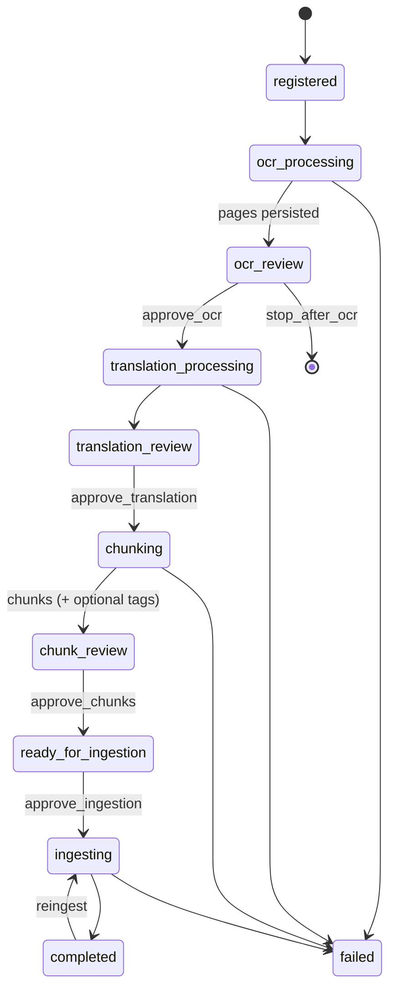

# Document Ingestion Pipeline — Design & Flow

This document explains **how a document moves through the ingestion pipeline**:
stages, review gates, services involved, and where state lives. It is the
flow-focused design reference for operators and integrators.

For broader architecture rationale (search model, auth design, deployment), see
[`DESIGN.md`](DESIGN.md). For HTTP request/response contracts, see
[`api-contracts.md`](api-contracts.md).

---

## 1. Purpose

The pipeline turns source files (PDF, office, images, spreadsheets) into
**reviewed, provenance-linked text chunks** and publishes them to a **Marqo**
search index.

The path is **review-driven**: processing pauses at human gates after OCR,
translation, chunking, and before ingestion. Operators can edit and approve
before anything reaches search.

```text
source file
  → register / upload
  → normalize + OCR / extract
  → OCR review
  → language detect + translate (non-English)
  → translation review
  → chunk (+ optional domain tagging)
  → chunk review
  → pre-ingestion review
  → ingest to Marqo
  → completed
```

---

## 2. Services involved

| Service | Role in this flow |
|---|---|
| **API** (`pipeline/api.py`) | Accept uploads, start/signal Temporal workflows, serve pages/chunks, approvals, lifecycle ops |
| **Worker** (`pipeline/worker.py` + `activities.py`) | Run OCR, translation, chunking, tagging, Marqo ingest |
| **Temporal** | Durable orchestration, retries, wait-for-approval gates |
| **SQLite** (`pipeline/db.py`) | Authoritative document / page / chunk / job / audit state |
| **MinIO** | Original uploads and stage artifacts (normalized PDF, exports) |
| **Marqo** | Search index of approved, non-excluded chunks |
| **lang-detect** | Language detection before translation |
| **UI** (`ui/`) | Operator console (proxies `/api` → API) |
| **Keycloak** (optional) | OIDC auth when `AUTH_DISABLED=false` |
| **External model endpoints** | OCR / translation / chunking / tagging (vLLM or similar) |

The UI does **not** talk to Temporal or Marqo directly. The API starts and
signals workflows; the worker performs heavy stage work and mirrors progress
into SQLite.

---

## 3. Stage machine (code names)

Stages are defined in `pipeline/models.py` (`DocumentStage`) and driven by
`DocumentPipelineWorkflow` in `pipeline/workflows.py`.

| Order | Stage | Kind | What happens |
|------:|---|---|---|
| 1 | `registered` | entry | Document row created; Temporal workflow started |
| 2 | `ocr_processing` | auto | Normalize input; OCR or native extract; persist pages |
| 3 | `ocr_review` | **gate** | Wait for `approve_ocr` (unless `auto_approve`) |
| 4 | `translation_processing` | auto | Per-page language detect + translate non-English |
| 5 | `translation_review` | **gate** | Wait for `approve_translation` |
| 6 | `chunking` | auto | Build chunks from page final text; optional auto-tag |
| 7 | `chunk_review` | **gate** | Wait for `approve_chunks` |
| 8 | `ready_for_ingestion` | **gate** | Wait for `approve_ingestion` |
| 9 | `ingesting` | auto | Write non-excluded chunks to Marqo |
| 10 | `completed` | terminal | Indexed and done |
| — | `failed` | terminal | Activity retries exhausted; error stored on the document |

Optional flags at start:

- `auto_approve=true` — skip all review gates (trusted bulk / backfill)
- `stop_after_ocr=true` — end after OCR review (OCR-only run)



---

## 4. Happy-path flow (step by step)

### 4.1 Register or upload

**Entry APIs**

- `POST /upload` — multipart file upload (stores bytes in MinIO, then starts workflow)
- `POST /documents` — register a server-side filepath (must be under allowed paths)
- `POST /documents/batch` — batch register

**What is created**

1. Content fingerprint (MD5) — used as `document_id` / dedupe key within `instance`
2. MinIO object (upload path) or validated local path
3. SQLite `documents` row at stage `registered`
4. Temporal `DocumentPipelineWorkflow` on queue `ocr-pipeline`
5. A `document_jobs` row for the run

**Deduplication (`POST /upload`)**

- Same content fingerprint + same `instance` → return existing document with
  `deduplicated=true` (no new workflow), unless `force_new=true`.

### 4.2 OCR processing

Activity: `run_ocr_and_store`

- Office/images → normalized PDF (stored in MinIO)
- Spreadsheets may use native extract without OCR
- Pages written to SQLite `pages` (`original_markdown`, provider/model metadata)
- Stage → `ocr_review`

### 4.3 OCR review (gate)

Operators edit/approve pages via:

- `GET/PATCH /documents/{workflow_id}/pages/{n}`
- `POST /documents/{workflow_id}/approve-ocr` → Temporal signal `approve_ocr`

### 4.4 Translation processing

Activity: `detect_and_translate_pages_from_db`

- Calls lang-detect per page
- Translates non-English pages
- Stores `detected_language`, `translated_markdown`, translation provenance
- Stage → `translation_review`

### 4.5 Translation review (gate)

- `PATCH` page fields (`edited_translation`, `translation_reviewed`, …)
- `POST …/approve-translation` → signal `approve_translation`

### 4.6 Chunking (+ optional tagging)

Activities: `create_chunks_from_db`, then optionally `auto_tag_chunks_from_db`

- Chunk text comes from each page’s **final text**:
  edited translation → machine translation → edited/original OCR markdown
- Chunks stored in SQLite with page spans and chunking provenance
- Domain tags may be written to `chunk_tags`
- Stage → `chunk_review`

### 4.7 Chunk review (gate)

- `GET/PATCH /documents/{workflow_id}/chunks/{n}`
- Include / exclude (`is_excluded`), edit text, tags
- `POST …/approve-chunks` → signal `approve_chunks`
- Stage → `ready_for_ingestion`

### 4.8 Pre-ingestion review (gate)

- Final operator check
- `POST …/approve-ingestion` → signal `approve_ingestion`
- Stage → `ingesting`

### 4.9 Ingest to Marqo

Activity: `ingest_document_from_db` / `ingest_to_marqo`

- Skips excluded chunks (`is_excluded`)
- Writes tensor + filterable metadata (`doc_id`, `chunk_num`, `instance`, tags, …)
- Updates index status; stage → `completed`

---

## 5. Partial / recovery workflows

These re-drive a stage without restarting the whole pipeline
(`pipeline/workflows.py`):

| Workflow | Trigger API | Effect |
|---|---|---|
| `OcrOnlyWorkflow` | `POST …/retry-ocr` | Re-run OCR → stop at OCR review |
| `TranslationOnlyWorkflow` | `POST …/retry-translation` | Translate again → translation review |
| `ChunkingOnlyWorkflow` | `POST …/retry-chunking` | Re-chunk → chunk review |
| `ReingestionWorkflow` | `POST …/reingest` (alias `…/retry-ingestion`) | Push current non-excluded SQLite chunks to Marqo |

**Reconcile** (`POST …/reconcile`): if SQLite stage lags behind materialized
pages/chunks after a crash, advance the row forward to the review stage the
data already supports.

---

## 6. Where data lives

| Concern | Store | Notes |
|---|---|---|
| Document stage, pages, chunks, tags, jobs, audit | **SQLite** | Source of truth for review content |
| Original file, normalized PDF, stage JSON exports | **MinIO** | Binary artifacts; metadata in `document_artifacts` |
| Workflow waits / retries | **Temporal** | Durable execution, not edited text |
| Searchable vectors | **Marqo** | Downstream projection of approved chunks |

Identity keys used by clients:

- **`workflow_id`** — primary key for almost all document APIs
- **`document_id`** — content hash used in Marqo `doc_id` (and related fields)

---

## 7. Lifecycle after completion

These are separate from the stage machine but part of day-2 operations:

| Action | Behavior |
|---|---|
| **Document Include off** (`POST …/query-enabled`) | Mark all chunks excluded; remove doc’s chunks from Marqo. Doc stays in list. |
| **Document Include on** | Un-exclude chunks; mark reindex required — **reingest** to put them back in Marqo. |
| **Document Delete** (`DELETE …`) | Soft-hide (`is_disabled`); Include off; remove from Marqo. MinIO/SQLite kept. |
| **Restore** | Unhide only; still needs Include + reingest for search. |
| **Chunk Include off** | Exclude one chunk; remove that chunk from Marqo if already ingested. |
| **Chunk Delete** (`DELETE …/chunks/{n}`) | Hard-delete chunk from SQLite + Marqo. Numbers are not renumbered. Reingest will not restore it (needs re-chunk). |
| **Reingest** | Re-publish current non-excluded chunks to Marqo. |

---

## 8. Auth & tenancy (pipeline-relevant)

- Default: `AUTH_DISABLED=true` → synthetic local admin (no JWT).
- When auth is on: Bearer JWT from Keycloak; permissions gate upload / review /
  pipeline / admin / search.
- Documents carry an **`instance`** (tenant). Upload dedupe and list/create
  scoping are instance-aware. Marqo records include `instance` for filtering
  when the index supports it.

Details: [`DESIGN.md`](DESIGN.md) §6 and [`auth-control-surfaces-review.md`](auth-control-surfaces-review.md).

---

## 9. Key source files

| File | Responsibility |
|---|---|
| `pipeline/workflows.py` | Stage machine, signals, partial workflows |
| `pipeline/activities.py` | OCR, translate, chunk, tag, ingest, MinIO/Marqo helpers |
| `pipeline/api.py` | HTTP surface |
| `pipeline/db.py` | SQLite schema and CRUD |
| `pipeline/models.py` | Stages and API DTOs |
| `pipeline/worker.py` | Temporal worker registration |
| `docker-compose.yml` | Service topology |
| `.env.example` | Configuration contract |

---

## 10. Related docs

| Doc | Contents |
|---|---|
| [`DESIGN.md`](DESIGN.md) | Full architecture & design rationale |
| [`api-contracts.md`](api-contracts.md) | HTTP API contracts for this pipeline |
| [`marqo-multi-tenant-migration.md`](marqo-multi-tenant-migration.md) | Per-tenant Marqo index options |
| [`../README.md`](../README.md) | How to run the stack |
