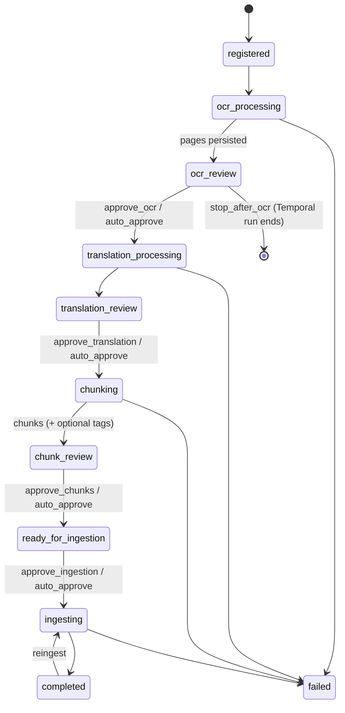

# Document Ingestion Pipeline — Design & Flow

This document explains **how a document moves through the ingestion pipeline**:
stages, review gates, services involved, and where state lives. It is the
flow-focused design reference for operators and integrators.

For broader architecture rationale (search model, auth design, deployment), see
[`DESIGN.md`](DESIGN.md). For HTTP request/response contracts, see
[`api-contracts.md`](api-contracts.md).

---

## 1. Purpose

The pipeline turns source files (PDF, office, images, spreadsheets) into
**reviewed, provenance-linked text chunks** and publishes them to a **Marqo**
search index.

The path is **review-driven**: processing pauses at human gates after OCR,
translation, chunking, and before ingestion. Operators can edit and approve
before anything reaches search.

```text
source file
  → register / upload
  → normalize + OCR / extract
  → OCR review
  → language detect + translate (non-English)
  → translation review
  → chunk (+ optional domain tagging)
  → chunk review
  → pre-ingestion review
  → ingest to Marqo
  → completed
```

---

## 2. Services involved

| Service | Role in this flow |
|---|---|
| **API** (`pipeline/app.py`, `pipeline/routers/`) | Accept uploads, start/signal Temporal workflows, serve pages/chunks, approvals, lifecycle ops |
| **Worker** (`pipeline/temporal/worker.py` + `document_tasks.py`) | Run OCR, translation, chunking, tagging, Marqo ingest |
| **Temporal** | Durable orchestration, retries, wait-for-approval gates |
| **SQLite** (`pipeline/db.py`) | Authoritative document / page / chunk / job / audit state |
| **MinIO** | Original uploads and stage artifacts (normalized PDF, exports) |
| **Marqo** | Search index of approved, non-excluded chunks |
| **lang-detect** | Language detection before translation |
| **UI** (`ui/`) | Operator console (proxies `/api` → API) |
| **Keycloak** (optional) | OIDC auth when `AUTH_DISABLED=false` |
| **External model endpoints** | OCR / translation / chunking / tagging (vLLM or similar) |

The UI does **not** talk to Temporal or Marqo directly. The API starts and
signals workflows; the worker performs heavy stage work and mirrors progress
into SQLite via `update_document_state` as each stage advances.

---

## 3. Stage machine (code names)

Stages are defined in `pipeline/models.py` (`DocumentStage`) and driven by
`DocumentPipelineWorkflow` in `pipeline/temporal/document_workflows.py`.

| Order | Stage | Kind | What happens |
|------:|---|---|---|
| 1 | `registered` | entry | Document row created; Temporal workflow started |
| 2 | `ocr_processing` | auto | Normalize input; OCR or native extract; persist pages |
| 3 | `ocr_review` | **gate** | Wait for `approve_ocr` (unless `auto_approve` or `stop_after_ocr`) |
| 4 | `translation_processing` | auto | Per-page language detect + translate non-English |
| 5 | `translation_review` | **gate** | Wait for `approve_translation` |
| 6 | `chunking` | auto | Build chunks from page final text; optional auto-tag |
| 7 | `chunk_review` | **gate** | Wait for `approve_chunks` |
| 8 | `ready_for_ingestion` | **gate** | Wait for `approve_ingestion` |
| 9 | `ingesting` | auto | Write non-excluded chunks to Marqo |
| 10 | `completed` | terminal | Indexed and done |
| — | `failed` | terminal | Activity retries exhausted; error stored on the document |

Optional flags at start:

- `auto_approve=true` — skip all four review waits (trusted bulk / backfill)
- `stop_after_ocr=true` — after pages are written, Temporal **returns immediately**
  at `ocr_review` (no approve wait). The SQLite row stays at `ocr_review`; the
  Temporal run is already finished, so `approve-ocr` will not continue that run.


```mermaid
stateDiagram-v2
    [*] --> registered
    registered --> ocr_processing
    ocr_processing --> ocr_review: pages persisted
    ocr_processing --> failed

    ocr_review --> translation_processing: approve_ocr / auto_approve
    ocr_review --> [*]: stop_after_ocr (Temporal run ends)

    translation_processing --> translation_review
    translation_processing --> failed

    translation_review --> chunking: approve_translation / auto_approve
    chunking --> chunk_review: chunks (+ optional tags)
    chunking --> failed

    chunk_review --> ready_for_ingestion: approve_chunks / auto_approve
    ready_for_ingestion --> ingesting: approve_ingestion / auto_approve
    ingesting --> completed
    ingesting --> failed

    completed --> ingesting: reingest
```

---

## 4. Happy-path flow (step by step)

### 4.1 Register or upload

**Entry APIs**

- `POST /upload` — multipart file upload (stores bytes in MinIO, then starts workflow)
- `POST /documents` — register a server-side filepath (must be under allowed paths)
- `POST /documents/batch` — scan a server directory and register each supported file

**Identities**

- **`document_id` / content fingerprint** — MD5 of file bytes (also stored as
  `source_file_fingerprint`; used in Marqo `doc_id`)
- **`workflow_id`** — derived from the storage path (`doc-{md5(filepath)[:12]}`).
  This is the key almost all APIs use.

**What is created**

1. MinIO object (upload) or validated local path (register)
2. SQLite `documents` row at stage `registered`
3. Temporal `DocumentPipelineWorkflow` on queue `ocr-pipeline`
4. A `document_jobs` row for the run

**Reuse**

- Same MinIO path (`{hash}/{filename}`) + existing SQLite row + queryable Temporal
  workflow → return that document (no new run)
- If SQLite no longer has the row → start a fresh Temporal id
  (`{base}-rerun-{timestamp}`)

### 4.2 OCR processing

Activity: `run_ocr_and_store`

- Office/images → normalized PDF (stored in MinIO)
- Spreadsheets may use native extract without OCR
- Pages written to SQLite `pages` (`original_markdown`, provider/model metadata)
- Stage mirrored to `ocr_review`

### 4.3 OCR review (gate)

Operators edit/approve pages via:

- `GET/PATCH /documents/{workflow_id}/pages/{n}`
- `POST /documents/{workflow_id}/approve-ocr` → Temporal signal `approve_ocr`
  (no request body; response `{"approved":"ocr","workflow_id":…}`)

Skipped when `auto_approve=true`. Not used when `stop_after_ocr=true` (run already ended).

### 4.4 Translation processing

Activity: `detect_and_translate_pages_from_db`

- Calls lang-detect per page
- Translates non-English pages
- Stores `detected_language`, `translated_markdown`, translation provenance
- Stage → `translation_review`

### 4.5 Translation review (gate)

- `PATCH` page fields (`edited_translation`, `translation_reviewed`, …)
- `POST …/approve-translation` → signal `approve_translation`

### 4.6 Chunking (+ optional tagging)

Activities: `create_chunks_from_db`, then optionally `auto_tag_chunks_from_db`
(Temporal patch `auto-tag-v1`)

- Chunk text comes from each page’s **final text**:
  edited translation → machine translation → edited/original OCR markdown
- Chunks stored in SQLite with page spans and chunking provenance
- Domain tags may be written to `chunk_tags`
- Stage → `chunk_review`

### 4.7 Chunk review (gate)

- `GET/PATCH /documents/{workflow_id}/chunks/{n}`
- Include / exclude (`is_excluded`), edit text, tags
- `POST …/approve-chunks` → signal `approve_chunks`
- Stage → `ready_for_ingestion`

### 4.8 Pre-ingestion review (gate)

- Final operator check
- `POST …/approve-ingestion` → signal `approve_ingestion`
- Stage → `ingesting`

There is **no** bulk approve-ingestion endpoint (only OCR / translation / chunks).

### 4.9 Ingest to Marqo

Activity: `ingest_document_from_db` (builds payload, may export to MinIO, then
calls `ingest_to_marqo`)

- Loads all chunks, including excluded, and writes `query_enabled` from `is_excluded`
- Writes tensor + filterable metadata (`doc_id`, `chunk_num`, `instance`, tags, …)
- Updates index status; stage → `completed`

Reingest **adds/updates** documents in Marqo from current SQLite chunks (excluded
chunks stay in the index with `query_enabled:false`). Include-off / Delete flip
that flag; they do not delete records.

---

## 5. Partial / recovery workflows

These re-drive a stage without restarting the whole pipeline
(`pipeline/temporal/document_workflows.py`). They start a **new** Temporal workflow id
(e.g. `{wf}-retry-ocr-{ts}`) but update the **original** SQLite `workflow_id`.

| Workflow | Trigger API | Effect |
|---|---|---|
| `OcrOnlyWorkflow` | `POST …/retry-ocr` | Re-run OCR → stop at OCR review |
| `TranslationOnlyWorkflow` | `POST …/retry-translation` | Translate again → translation review |
| `ChunkingOnlyWorkflow` | `POST …/retry-chunking` | Re-chunk → chunk review |
| `ReingestionWorkflow` | `POST …/reingest` (alias `…/retry-ingestion`) | Push current SQLite chunks to Marqo (`query_enabled` from `is_excluded`) |

**Reconcile** (`POST …/reconcile` and bulk `POST /documents/reconcile`):

1. Advance SQLite stage forward to match materialized pages/chunks when possible
2. Optionally sync from Temporal `get_state`
3. Never marks `failed`. A missing, unqueryable or unreachable Temporal execution
   leaves the document on its SQLite stage and is reported as a skip
4. Bulk reconcile buckets every checked document into `updated`, `still_running`,
   `skipped` or `errors`, so the counters always sum to `checked`

---

## 6. Where data lives

| Concern | Store | Notes |
|---|---|---|
| Document stage, pages, chunks, tags, jobs, audit | **SQLite** | Source of truth for review content |
| Original file, normalized PDF, stage JSON exports | **MinIO** | Binary artifacts; metadata in `document_artifacts` |
| Workflow waits / retries | **Temporal** | Durable execution, not edited text |
| Searchable vectors | **Marqo** | Downstream projection of approved chunks |

---

## 7. Lifecycle after completion

These are separate from the stage machine but part of day-2 operations:

| Action | Behavior |
|---|---|
| **Document Delete** (`DELETE …`) | Soft-hide (`is_disabled`); optionally hide all chunks in Marqo via `query_enabled` (`remove_from_search=true` by default). MinIO kept unless `purge_artifacts=true`. |
| **Purge artifacts** (`POST …/purge-artifacts`) | Dry-run by default; `apply=true` deletes listed MinIO objects for a disabled doc. |
| **Restore** | Clears `is_disabled` only. Include-on flips `query_enabled` back (no reingest). |
| **Chunk exclude** (`PATCH …/chunks/{n}` with `is_excluded=true`) | Hide one chunk from search via `query_enabled`; row stays. |
| **Reingest** | Re-publish current SQLite chunks to Marqo (used after text/tag edits, not Include). |

---

## 8. Auth & tenancy (pipeline-relevant)

- Default: `AUTH_DISABLED=true` → synthetic local admin (no JWT).
- When auth is on: Bearer JWT from Keycloak; permissions gate upload / review /
  pipeline / admin / search / manage_users.
- Documents carry an **`instance`** (tenant). List/create scoping is
  instance-aware. Marqo records include `instance` for filtering
  when the index supports it.

Details: [`DESIGN.md`](DESIGN.md) §6 and [`auth-control-surfaces-review.md`](auth-control-surfaces-review.md).

---

## 9. Key source files

| File | Responsibility |
|---|---|
| `pipeline/temporal/document_workflows.py` | Stage machine, signals, partial workflows |
| `pipeline/temporal/document_tasks.py` | Temporal retry boundaries for OCR, translate, chunk, tag, ingest, and state updates |
| `pipeline/ingestion_records.py` | SDK-independent vector records, text cleanup, and provenance fields |
| `pipeline/app.py` | FastAPI construction and route registration |
| `pipeline/routers/` | HTTP route handlers |
| `pipeline/services/` | Document, workflow, search, index, taxonomy, tenant, and access operations |
| `pipeline/temporal/client.py` | Lazy Temporal client and task-queue ownership |
| `pipeline/storage/minio.py` | Lazy API-side MinIO client |
| `pipeline/vector_store.py` | Marqo adapter and schema/filter grammar |
| `pipeline/keycloak_admin.py` | Keycloak identity-plane adapter |
| `pipeline/db.py` | SQLite schema and CRUD |
| `pipeline/models.py` | Stages and API DTOs |
| `pipeline/temporal/worker.py` | Temporal worker registration (`pipeline.worker` remains the launcher) |
| `docker-compose.yml` | Service topology |
| `.env.example` | Configuration contract |

---

## 10. Related docs

| Doc | Contents |
|---|---|
| [`DESIGN.md`](DESIGN.md) | Full architecture & design rationale |
| [`api-contracts.md`](api-contracts.md) | HTTP API contracts for this pipeline |
| [`auth-control-surfaces-review.md`](auth-control-surfaces-review.md) | Auth control surfaces |
| [`../README.md`](../README.md) | How to run the stack |
